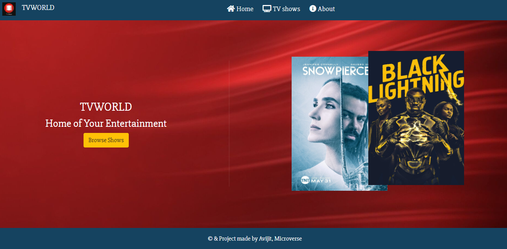
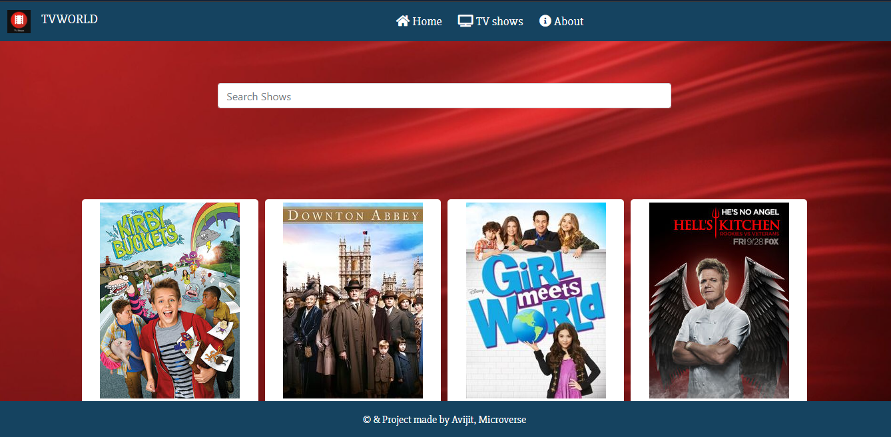
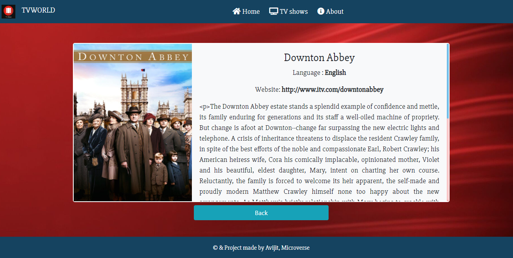
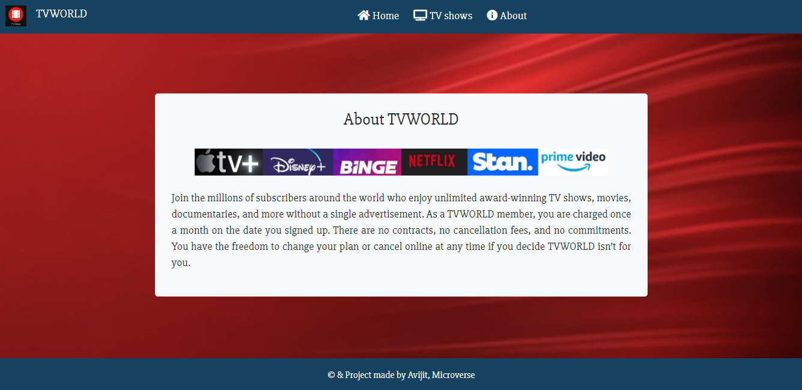

# React-redux-capstone-tvshowcatalogue

This is a capstone project of microverse redux-react module. This is a catalogue for tv shows that displays information about a particular show. User can search for their favourite tv by using the search input option. This single page application displays list of popular shows with thumbnail images. User can see more information about their favourite show by clicking on the show info button. Individual page of the show provides overview of the show, summary, schedule time and date, it's current status etc. This application uses redux to store data and to serve data. React-router was used to define several links which makes the app useful.  

## Project Display






## Live Demo

[TVWORLD](https://blissful-meninsky-3fa5c8.netlify.app/shows)

## Built With

- Html
- Css
- Vanila Js
- Atom text editor
- React Js
- redux
- react-redux
- Npm

# Getting Started

To get a local copy of the repository please run the following commands on your terminal:

```
$ cd <folder>
```

```bash

$ git clone `https://github.com/ajkacca457/react_capstone_tvshowcatalouge.git`
$ cd react_capstone_tvshowcatalouge
$ Run `npm install` to install the necessary modules
$ Run `npm run start` to open app in localhost.

```
# Authors

👤 **Avijit Karmaker**

- Github: [@Avijit](https://github.com/ajkacca457)
- Linkedin: [@Avijit](https://www.linkedin.com/in/avijit-karmaker-8738a54)

## 🤝 Contributing

Contributions, issues and feature requests are welcome!

## Show your support

Give a ⭐️ if you like this project!

## Copyright
This is a project developed by Avijit.
